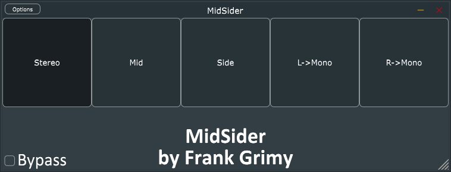

# MidSider

## A simple __mid-side__ and __left/right-to-mono__ audio monitoring plugin

MidSider is a simple audio monitoring plugin that allows you to listen to the mid and side channels of a stereo signal separately, as well as the left and right channels in mono.

This is useful to quickly check the stereo width of a signal, or to listen to the mono compatibility of it.

Instead of having to set up a mid-side matrix in your DAW, you can just slap this plugin on your master track (or any other you want) and quickly check the stereo properties of your mix, by soloing the mid or side channels.

### Features

- Can be used as a mid-side listening tool, or as a left or right-to-mono converter
- Lightweight and simple to use
- Resizable and fully vectorial GUI.
